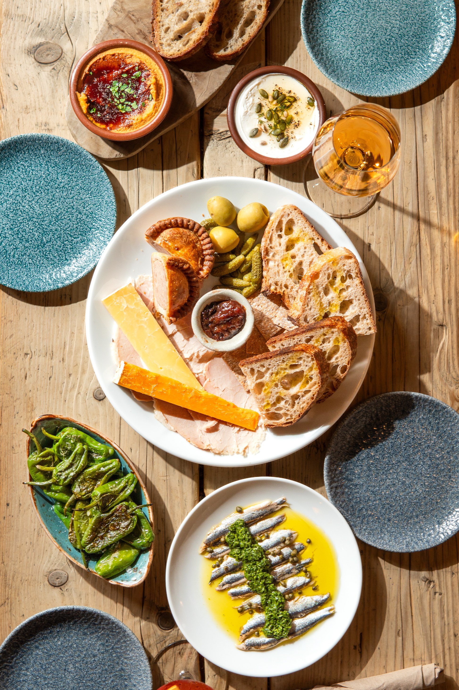

# claws Image — Portfolio Site Setup Guide

## Folder structure to create on your laptop

```
index.html
images/
  friends-of-ham/        ← all Friends of Ham photos
  galipette/             ← all Galipette photos
  galipette-cidre/       ← all Galipette Cidre photos
  mama-li/               ← all Mama Li photos
  laam-owt/              ← all Laam x OWT photos
  chabuddy-sobe/         ← all Chabuddy G x SoBe Burger photos
  owt/                   ← all OWT photos
  owt-leeds/             ← all OWT Leeds photos
  ritz-crackers/         ← all Ritz Crackers photos
  little-bao-boy/        ← all Little Bao Boy photos
  shop-cuvee/            ← all Shop Cuvée photos
  laam/                  ← all Laam photos
  sobe-burger/           ← all SoBe Burger photos
  mikos-gyros/           ← all Mikos Gyros photos
  hoko/                  ← all HOKO photos
  top-cuvee/             ← all Top Cuvée photos
  eat-your-greens/       ← all Eat Your Greens photos
  brown-and-blond/       ← all Brown & Blond photos
  poco/                  ← all POCO photos
  ichi-sushi/            ← all Ichi Sushi photos
  fika-north/            ← all Fika North photos
  ride-and-grind/        ← all Ride & Grind photos
  ride-and-grind-coffee/ ← all Ride & Grind Coffee photos
  love-for-mushroom/     ← all Love for Mushroom photos
  waitrose/              ← all Waitrose Magazine photos
  casa-coffee/           ← all Casa Coffee photos
  contact/               ← photos for the Contact page (see below)
```

---

## Contact page images

Create a folder called `contact` inside `images/` and put these files in it:

| Filename to use | What it is |
|---|---|
| portrait.jpg | Your portrait photo (the one of Claudia) |
| DSC02702.jpg | Second contact page photo |
| service-food.jpg | Food Photography service card image |
| service-video.jpg | Video Content service card image |
| service-design.jpg | Design & Photography service card image |

These are the only files you need to rename — just 5 files.

---

## How to add more photos to a project gallery

Each project gallery has a comment in the HTML that says:
```
<!-- ADD MORE: copy a line above, change the filename -->
```

To add more photos, open `index.html` in any text editor (TextEdit on Mac works fine), find that comment for the project you want, and copy the line above it, changing the filename. For example:

```html


<!-- ADD MORE: copy a line above, change the filename -->
```

---

## Uploading to GitHub

1. Go to your `clawsimage.github.io` repo on GitHub
2. Click **Add file → Upload files**
3. Upload the `index.html` file first
4. Then upload each project folder one at a time:
   - Click **Add file → Upload files**
   - Drag the whole folder in
   - GitHub will ask you to confirm the path — make sure it shows `images/friends-of-ham/` etc.
   - Click **Commit changes**
5. Repeat for each folder

---

## Connecting your domain (clawsimage.com)

**In GitHub:**
1. Go to Settings → Pages
2. Under Custom domain, type `clawsimage.com` and click Save
3. Tick Enforce HTTPS once it appears

**In Namecheap:**
1. Go to Domain List → Manage → Advanced DNS
2. Delete any existing A records, then add these:

| Type | Host | Value |
|---|---|---|
| A Record | @ | 185.199.108.153 |
| A Record | @ | 185.199.109.153 |
| A Record | @ | 185.199.110.153 |
| A Record | @ | 185.199.111.153 |
| CNAME Record | www | clawsimage.github.io |

DNS takes up to 24 hours but is usually live within 1–2 hours.

---

## How to update the site in future

- **Swap a cover photo**: upload a new image with the same filename into the project folder on GitHub
- **Add a new photo to a gallery**: add an `` line in index.html next to the `<!-- ADD MORE -->` comment
- **Add a brand new project**: copy an entire project block in the Work page section and update the folder name, image paths, and project title
